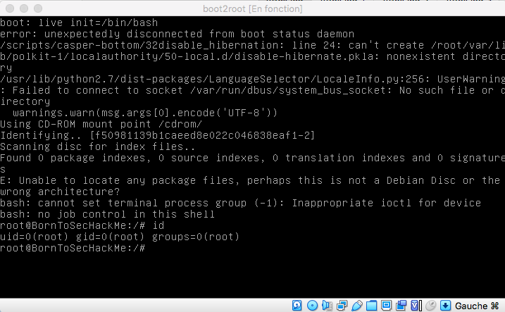

# GrubInit

Open VirtualBox.

Start VM.

keep the `shift` key entered while booting.

A GRUB prompt should pop up.

Enter this command to change the init program with a shell:
```
boot: live init=/bin/bash
```


Congratuation, you now have a root shell !!